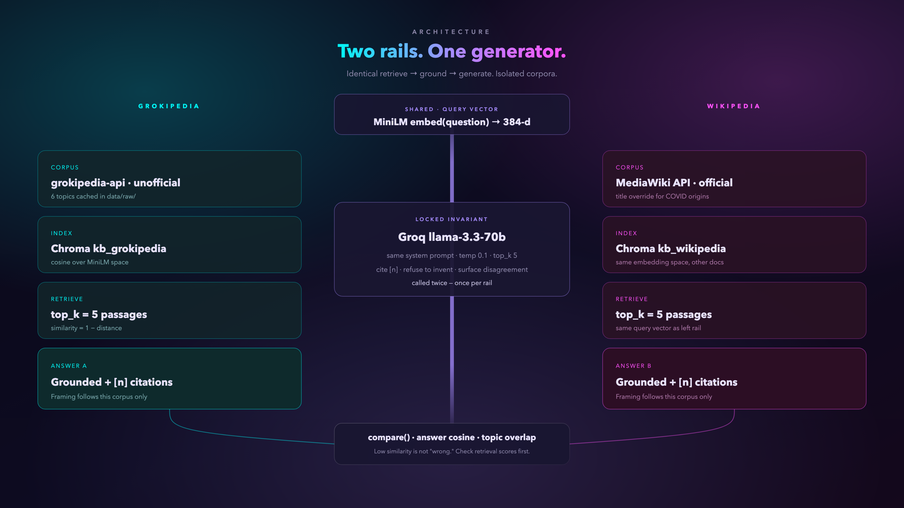
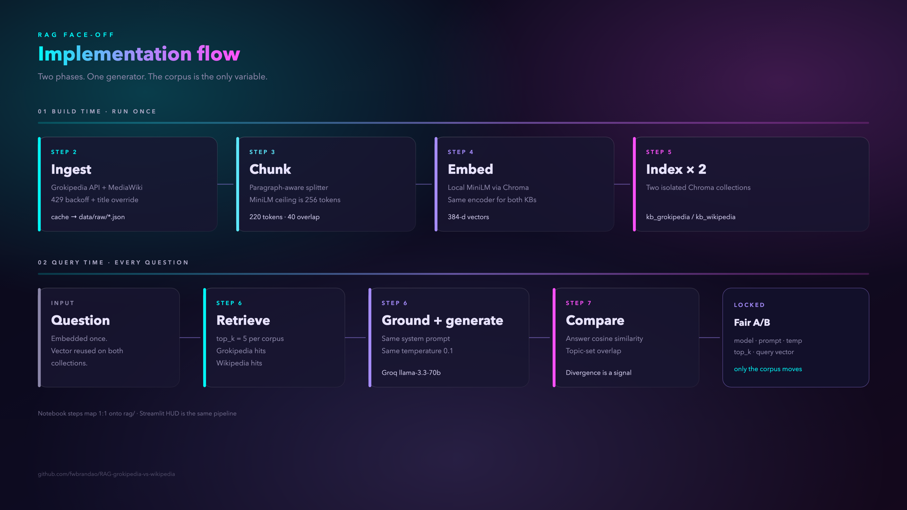

# RAG Face-Off: Grokipedia vs. Wikipedia

Two independent RAG pipelines over two encyclopedias, answering the same question
side by side. The generator is identical on both sides — same model, prompt, temperature, and
`top_k` — so the **only** variable is the corpus.

**Runs completely free.** Groq's free tier for generation, local MiniLM embeddings via
ChromaDB. No credit card, no per-token cost.


## What it does

```
topics ──► ingest (Grokipedia API + MediaWiki API)
       ──► chunk (paragraph-aware, token-budgeted)
       ──► embed (MiniLM locally, or text-embedding-3-small)
       ──► two Chroma collections: kb_grokipedia / kb_wikipedia
       ──► retrieve top-k ──► LLM ──► side-by-side answers
```

- **Notebook** [`RAG-compare.ipynb`](RAG-compare.ipynb) — teaching walkthrough (Steps 0–9).
- **Live UI** [`app.py`](app.py) — cinematic split-screen (Grokipedia cyan / Wikipedia magenta).
- Shared pipeline in [`rag/`](rag/).

## Architecture

Two rails. One generator. The corpus is the only variable.





More diagrams (sequence + fair A/B contract) and post stills live in [`assets/diagrams/`](assets/diagrams/) and [`assets/`](assets/).

## Quick start (free)

```bash
python3 -m venv .venv
source .venv/bin/activate
pip install -r requirements.txt
cp .env.example .env   # paste GROQ_API_KEY from https://console.groq.com/keys
```

**Notebook**

```bash
jupyter lab RAG-compare.ipynb
```

Run top to bottom. Steps 1–6 build the indexes; Step 8 is the widget UI; Step 9 is batch eval.
Follow-along: [`LEARN.md`](LEARN.md).

**Streamlit UI**

```bash
streamlit run app.py
```

First run embeds cached articles in `data/raw/` (a minute or two). Later runs reuse `data/chroma/`.

## Live demo (Streamlit Community Cloud)

1. Push this repo to GitHub.
2. Go to [share.streamlit.io](https://share.streamlit.io), sign in with GitHub, **New app**.
3. Repository: `fwbrandao/RAG-grokipedia-vs-wikipedia` · Branch: `main` · Main file: `app.py`.
4. **Advanced settings → Secrets** — add:

```toml
GROQ_API_KEY = "gsk_..."
```

5. Deploy. The public URL will look like:

`https://rag-grokipedia-vs-wikipedia-ejglykwi6qnbvunielbn3e.streamlit.app`

Never put the key in the notebook, README, or git.

## Providers

Set `provider=` on `Settings` (notebook Step 1 / `rag.config.Settings`). All three speak the
OpenAI-compatible chat API.

| `provider` | Generation | Embeddings | Cost | Needs |
|---|---|---|---|---|
| `groq` *(default)* | `llama-3.3-70b-versatile` | MiniLM, local | Free | API key, no card |
| `ollama` | `llama3.1:8b` | MiniLM, local | Free | [Ollama](https://ollama.com) running locally |
| `openai` | `gpt-4o-mini` | `text-embedding-3-small` | ~$0.05 total | `OPENAI_API_KEY` |

MiniLM truncates at 256 tokens — the local path uses 220-token chunks. Collection names carry
an `EMBED_TAG` so MiniLM (384-d) and OpenAI (1536-d) never mix.

## Notebook structure

| Step | What happens |
|---|---|
| 0 | Install dependencies |
| 1 | Config — provider, embedding backend, chunking, `top_k`, topic list |
| 2 | Ingest both knowledge bases (cached to `data/raw/`) |
| 3 | Paragraph-aware token chunking |
| 4 | Embeddings — local or API, behind one interface, with retries |
| 5 | Two persistent Chroma collections |
| 6 | Retrieval + grounded generation with forced citations |
| 7 | `compare()` — one query embedding, both pipelines, divergence metrics |
| 8 | Side-by-side ipywidgets UI |
| 9 | Batch evaluation → sortable DataFrame + JSON export |

## Caveats

- **The Grokipedia client is unofficial.** It wraps internal endpoints and can break without
  notice. Everything is cached to `data/raw/`.
- **Free-tier limits change without notice.**
- **Divergence ≠ error.** Two different answers means the corpora differ in coverage, framing,
  or emphasis. Check the citations.
- **Retrieval dominates the variance.** Check `mean_retrieval_sim` before blaming a corpus.
- Six topics is a demo, not a study.

## License

MIT
